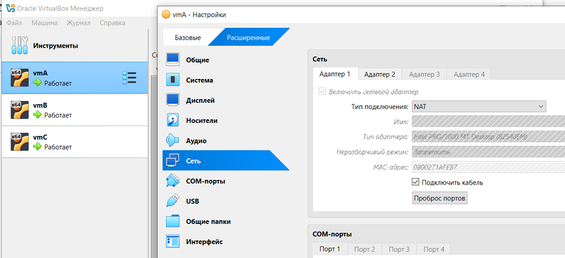
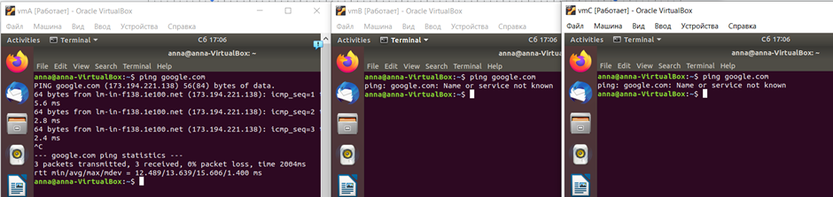
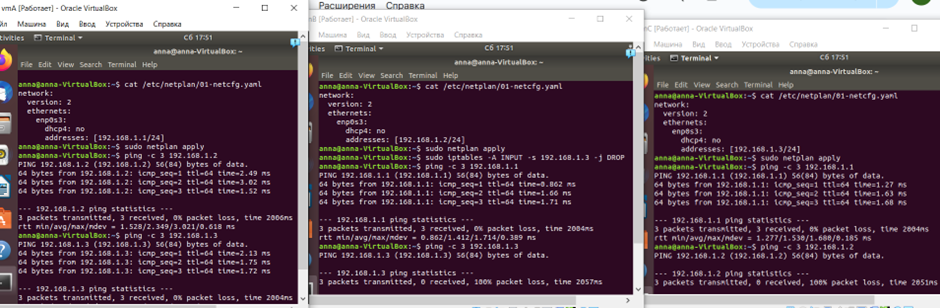

# Лабораторная работа №3. Виртуализация

## Цель работы
Изучить принципы виртуализации.

## Задание
Необходимо настроить виртуальную машину А с Ubuntu в VirtualBox. Обеспечить доступ в сеть Интернет. Осуществить проверку этого доступа и приложить скриншот из терминала. Следующим шагом настроить ещё одну виртуальную машину Б. После чего обеспечить сетевой доступ от машины А к машину Б. Приложить скриншот из терминала. Поднять ещё одну виртуальную машину В. Организовать сетевой доступ:

1. из машины А в машину Б.
2. из машины А в машину В, 
3. но запретить доступ из машины Б в машину В.
4. Приложить скриншот, на котором видно терминалы всех трёх машин.

## Ход работы

### Установка VirtualBox и создание виртуальных машин

В соответсвии с [туториалом](https://ubuntu.com/tutorials/how-to-run-ubuntu-desktop-on-a-virtual-machine-using-virtualbox#1-overview) c [официального сайта](https://www.virtualbox.org/) была скачана программа VirtualBox. Также был скачан [образ операционной системы Ubuntu](https://releases.ubuntu.com/bionic/). 

Были созданы три виртаульные машины - A (А), B (Б), C (В). Изначально ни на одной из них не открывался терминал, проблему удалось решить благодаря [StackOverflow](https://askubuntu.com/questions/1435918/terminal-not-opening-on-ubuntu-22-04-on-virtual-box-7-0-0).

### Настройка выхода в интернет и сетевых доступов

Первоочередно были обновлены настройки виртуальных машин. Для машины А были настроены два адаптера: NAT (для выхода в интернет) и адаптер для подключения к внутренней сети intnet. На машинах Б, В были настроены только адаптеры для подключения к внутренней сети intnet.



Демонстрация возможности выхода в интернет с машины А (пингуется гугл):



Далее на виртуальных машинах были заданы сетевые настройки (прописаны в файлах etc/netplan/01-netcfg.yaml). Адреса в сети - 192.168.1.n/24.

Машина А:
```
network:
  ethernets:
    enp0s3:
      dhcp4: no
      addresses: [192.168.1.1/24]
```
Машина Б:
```
network:
  ethernets:
    enp0s3:
      dhcp4: no
      addresses: [192.168.1.2/24]
```
Машина В:
```
network:
  ethernets:
    enp0s3:
      dhcp4: no
      addresses: [192.168.1.3/24]
```

Чтобы запретить сетевой доступ из машины Б в машину В, на машине Б была применена следующая команда (отбрасывает входящий трафик от машины В):
```
sudo iptables -A INPUT -s 192.168.1.3 -j DROP
```

Скриншот, на котором отражены параметры сетевых настроек и доступность необходимых машин (А <-> Б, А <-> В, Б -no- В).



## Заключение
В ходе выполнения лабораторной работы были настроены три виртуальные машины в VirtualBox. Обеспечен доступ в сеть Интернет для машины А, а также настроено сетевое взаимодействие между машинами А, Б и В с соответствующими ограничениями.
